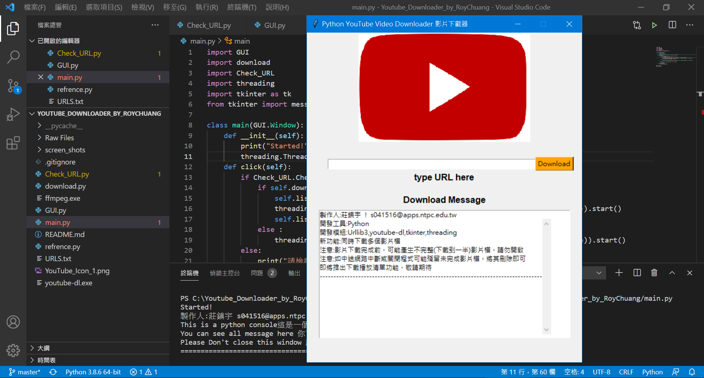
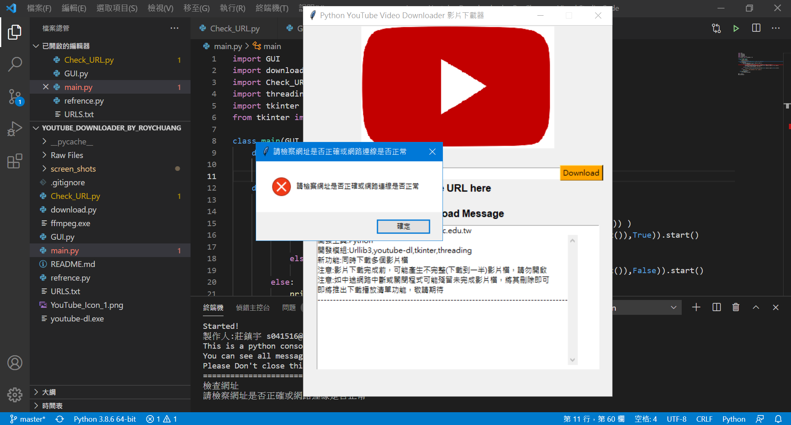
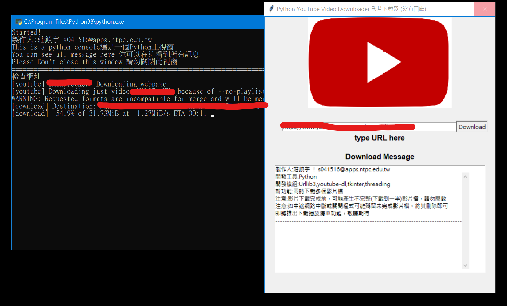

# Youtube_Downloader

製作人：Roy Chuang

Email：s041516@apps.ntpc.edu.tw

## 說明

你好！我是一位12歲的小學生，我住在台灣。我ˇ對程式設計非常有興趣。而現在的我，正在努力學習Python語言。因為它對我來說，是最簡單的程式語言。

現在，我正在創作這個專案，它可以從YouTube上下載影片和播放清單。但是對於那些專家而言，我還不是那麼擅長Python。我只是個新手。

如果你是Python專家。請拜託幫忙完成或改善這個專案，或給些寶貴建議。當然，最好是可以加入這個專案。非常感謝！

## 特色

使用youtube-dl來做為下載影片的工具，BeautifulSoup、Urllib.request內的urlopen用來確認網址是否正確 ，以及Python 內建的 tkinter GUI 來製作圖形使用者介面。

## 安裝

1. 使用pip 安裝工具安裝Urllib3

   `pip install urllib3`

2. 下載這裡的原始碼

3. 執行main.py

4. 可以開始使用了!!!

## 螢幕截圖

